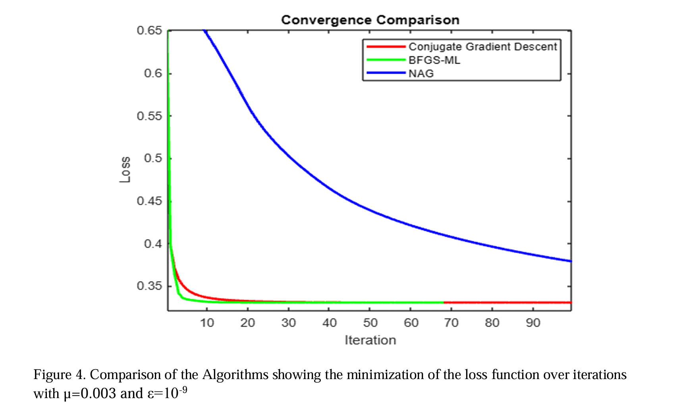
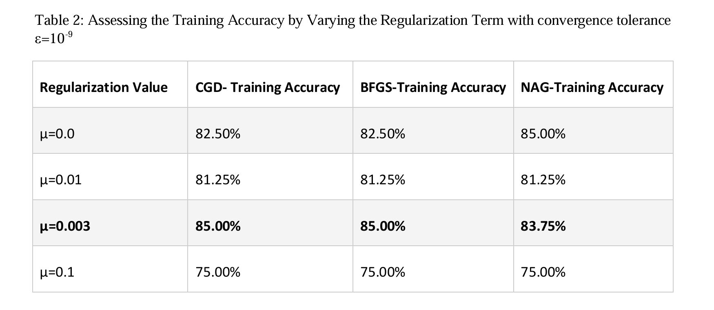

# A Multi-Optimization Approach to Classification of Sirtuin6 Small Molecule Inhibitors for Pre-Screening Potential Drug Candidate using Regularized Softmax Regression
**ECE 503: Optimization in Machine Learning (September 2023 - December 2023)**

## Overview
This project investigates the use of softmax multi-classification to classify potential small molecule inhibitors targeting the Sirtuin6 (SIRT6)** protein. The goal is to compare this model combined with optimization methods to enhance performance in identifying potential drug candidates. The optimized algorithms used were CGD, BFGS, and  NAG. In addition, feature reduction was applied using covariance analysis and eigenvalue decomposition.

The dataset was obtained from the UCI Machine Learning Repository and processed in MATLAB. Samples were labeled based on binding free energy (BFE), where high BFE values were labeled as potential inhibitors and low BFE values as non-inhibitors. The dataset was randomly shuffled to remove ordering bias and divided into training and testing datasets.

## Methods
1. Data collection from UCI Machine Learning Repository
2. Dataset labeling based on binding free energy (BFE)
3. Data shuffling and train-test split
4. Feature scaling and normalization
5. Optimization of the regularized softmax loss function
6. Comparison of optimization algorithms (CGD, BFGS, NAG)
7. Feature reduction using covariance and eigenvalue decomposition
8. Model retraining with reduced feature set
9. Performance evaluation using classification accuracy and confusion matrices

## Technologies
MATLAB  
Optimization Algorithms  
Softmax Regression  
Feature Reduction  
Statistical Data Normalization  

## Results
- Successful classification of potential SIRT6 inhibitor candidates
- Identification of optimal regularization parameter (μ = 0.003)
- Feature reduction significantly improved computational efficiency
- Achieved approximately 20× faster training time with comparable accuracy

## Visuals
  
  

