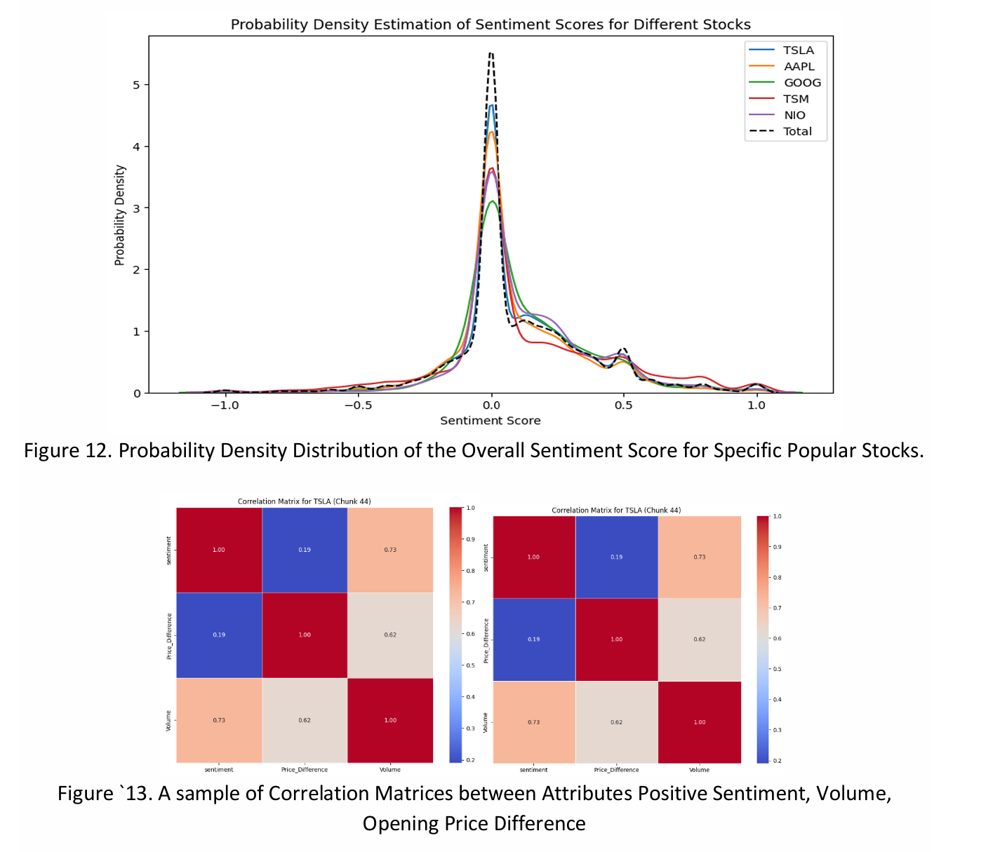
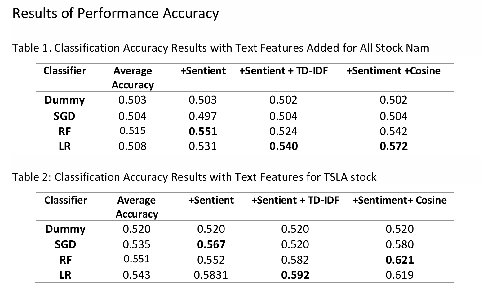

# Financial Textual Data Mining for Stock Market Trend Prediction

**CSC 503: Data Mining Course Project (January 2024 – April 2024)**

## Overview
This project analyzes financial Twitter data alongside stock market data to investigate whether social sentiment can improve stock trend prediction. Tweets related to the top 25 most watched stocks were text mined and combined with financial data to explore correlations between sentiment and stock price movement.

The objective was to determine whether Natural Language Processing (NLP) features derived from social media text can enhance machine learning classification models to predict market trends.

## Methods
- Collection of financial tweet data and stock price data from public datasets  
- Text preprocessing including tokenization, stopword removal, and stemming  
- Sentiment analysis using TextBlob to extract polarity scores from tweets  
- Feature engineering using TF-IDF vectorization, word embeddings, and cosine similarity  
- Machine learning classification using:
  - Logistic Regression
  - Random Forest
  - Stochastic Gradient Descent  
- Model evaluation using accuracy, F1-score, and cross-validation

## Results
- Incorporating tweet sentiment features improved stock trend prediction accuracy by 1–4% compared to baseline models  
- Random Forest and Logistic Regression outperformed stochastic gradient descent models  
- Sentiment classification using Support Vector Machines (SVM) achieved ~94% accuracy, outperforming Naïve Bayes (~82%)  
- Results demonstrate that social sentiment signals can contribute useful information for financial market analysis

---
## Visuals
  

