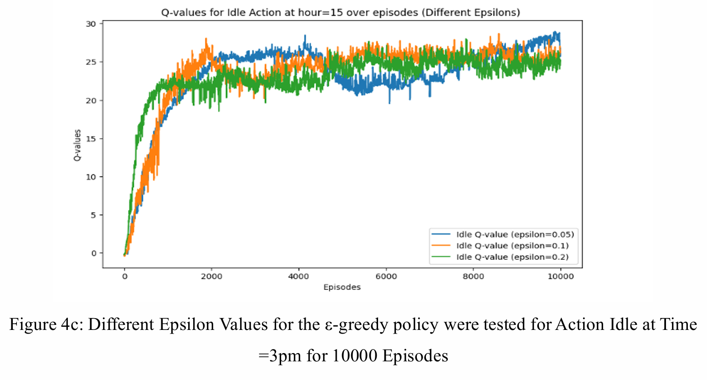
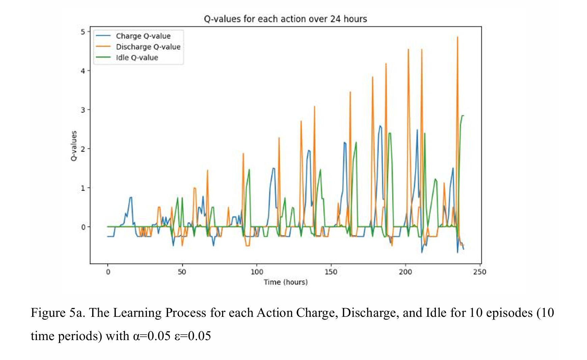
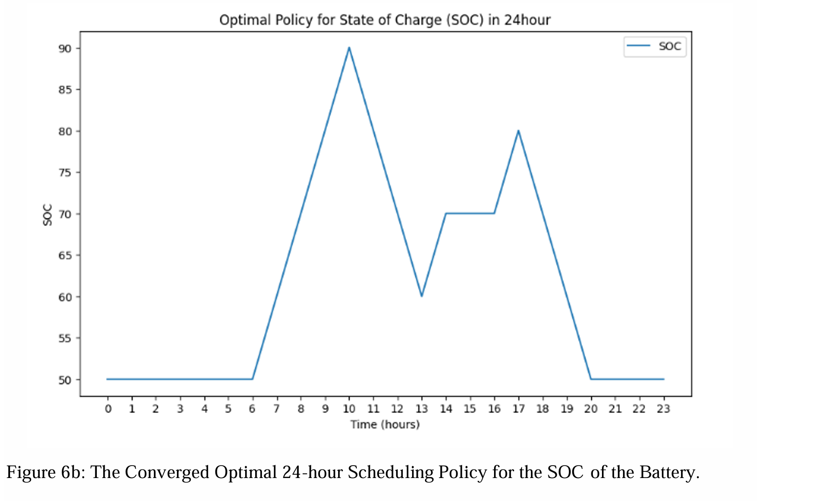

# Reinforcement Learning for Battery Management System Scheduling
**ECE 559B: Reinforcement Learning Course Project (September 2023 – December 2023)**

## Overview
This project applies reinforcement learning to optimize the scheduling policy of a residential Battery Management System (BMS) within a microgrid environment. The goal is to determine when a battery should charge, discharge, or remain idle based on consumer electricity demand, renewable energy availability, and the battery's state of charge (SOC).

A Q-learning algorithm was implemented to learn an optimal 24-hour scheduling policy. The agent interacts with a simulated environment representing consumer demand and renewable energy charging. The agent discovers strategies that charge the battery during periods of renewable energy availability and discharge during peak consumer demand.

## Methods
1. Define Battery Management System scheduling problem  
2. Formulate environment as a Markov Decision Process  
3. Simulate renewable energy availability and consumer demand  
4. Initialize Q-table for state-action values  
5. Train reinforcement learning agent using Q-learning  
6. Apply ε-greedy policy for exploration vs exploitation  
7. Update Q-values through temporal difference learning  
8. Evaluate learned scheduling policy over multiple episodes  

## Results
The Q-learning agent successfully learned an optimal battery scheduling strategy over multiple training episodes.
- Optimal hyperparameters were identified as learning rate α = 0.05 and exploration rate ε = 0.05
- After approximately 10,000 episodes, the algorithm converged to a stable optimal policy
- The agent learned to charge the battery during periods of renewable energy availability
- The agent discharged energy during peak consumer demand periods

The results demonstrate that even a tabular Q-learning approach can effectively learn energy scheduling strategies for battery storage systems in microgrid environments. 

---

## Visuals
  

