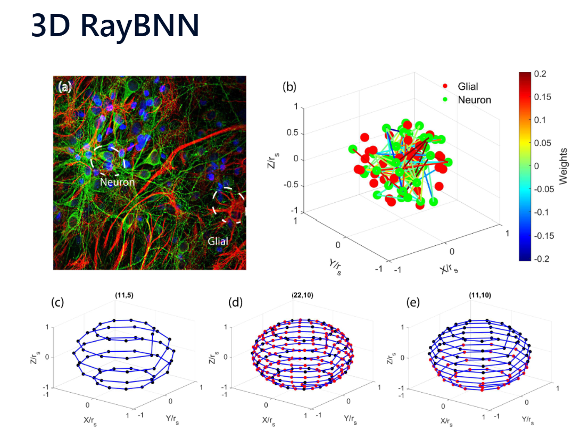

# Research Portfolio: 

This portfolio highlights my research applying distillation to a novel 3D neural network, RayBNN that utilizes transfer learning. My work extends this architecture by exploring reinforcement learning adaptability through policy distillation and reasoning capabilities through knowledge distillation from LLMs.

---

## Overview of RayBNN
 Unlike traditional layered neural networks, RayBNN distributes neurons and glial cells within a 3D spherical volume and establishes dynamic, sparse connectivity through ray-tracing algorithms. This architecture allows for flexible transfer learning, efficient computation, and adaptive learning behaviors.

**Key Features:**
- **3D Sphere Framework:** Neurons exist in a 3D space that can expand, shrink, or adapt dynamically.  
- **Component Distribution:** Hidden neurons and glial cells are uniformly distributed, preventing intersections.  
- **Input/Output Topology:** Input neurons on the surface preserve data dimensionality; output neurons at the origin simulate centralized brain aggregation.  
- **Ray-Traced Connections:** Sparse, dynamic axonal connections generated through ray-tracing instead of fixed layers.  
- **Adaptability:** Supports adding or migrating neurons for transfer learning without full retraining.  

**Training & Components:**
- **Ray-Tracing Algorithms:** Random ray generation (RT1), direct connections within the sphere (RT2), and distance-limited connections (RT3) create efficient pathways.  
- **Neural Architecture:** Sparse matrix representations (CSR) with a Universal Activation Function (UAF) handle 3D data flows.  
- **Biological Basis:** Models glial cell behavior to reduce power consumption and increase synaptic adaptation.  

---

## Research Work
I am currently extending RayBNN by integrating rl policy distillation** and LLM knowledge distillation to explore reasoning, decision-making, and adaptability.

### Reinforcement Learning Policy Distillation into RayBNN
- Train Teacher Polciy with RL algortihm wwith PPO and Actor/Critic Arichtetcure on Atari Game Pong
- Use CNN for feature enginnering enhancment to downsample the images pixels
- Distilled trained policy to the RayBNN
- Modify the archtiretucre for thes trained RayBNN to interact with game Pong
- Test performance againest Teacher perfomance and convergance rates

### LLM Knowledge Distillation into RayBNN
- Distilling knowledge from LLMs into RayBNN to improve reasoning and token prediction tasks.  
---

## Visuals
  

---
